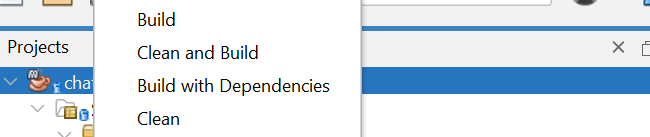

# CT240-CHAT-APP

---

## Cài đặt dự án

**Maven**

1. Download dự án về máy bằng link liên kết này:[Chat App](https://github.com/Nqvinh7603/CT240-Chat-App)
2. IDE: đề xuất Netbeans (mới nhất)
3. Cài đặt JDK 20 và apache maven
4. Cài đặt MySql workbench và tạo cơ sở dữ liệu có tên là **chatapp**
5. Click chọn tool có sẵn trên netbeans để clean và build dự án: 

---
